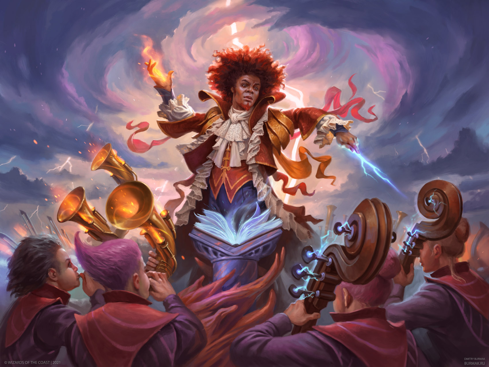

<h1 id="cover-heading">
  Mystic Maestro  <!-- TODO: Update title -->
</h1>

 <!--  TODO: Update username and repo name -->

>  ~~Mischief~~Mystic Managed   <!-- TODO: Replace with your description -->

<!-- TODO: Update to match your project's benefits/features. Git emojis work great here. -->

- :hourglass_flowing_sand: Quickly establish prices for enchantments
- :open_file_folder: Install easily from the launcher
- :sparkles: Mark favorite enchants to watch
- :nut_and_bolt: Built specifically for Project Ascension
- :pushpin: Easy to use and intuitive interface
- :cloud: Provides an API for other addons

[Get Started](#demystify-the-altar) <!-- TODO: Use ID of your homepage heading -->

<!-- TODO: Set your background color or image. -->

